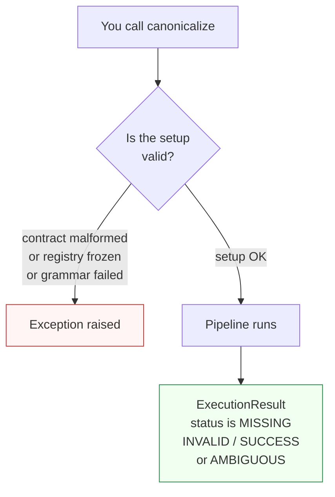

# Errors

Paxman uses two different signals for "something went wrong": **statuses** for domain answers and **exceptions** for misuse. Knowing which is which keeps your code and notebooks simple.

---

## Statuses vs exceptions



- A **status** (`MISSING`, `INVALID`, `AMBIGUOUS`, `SUCCESS`) is a normal domain answer. It means the pipeline ran, considered the input, and has a well-defined conclusion — even when that conclusion is "there is no valid answer." Handle it by branching on `result.status`.
- An **exception** means the call was not valid in the first place — a contract was malformed, the registry was frozen, or an internal grammar/rule failed unexpectedly. These are not values to canonicalize; they are programming or setup errors to fix.

Rule of thumb: **check `status` in normal code; catch exceptions only around setup and at the outer boundary of a batch.**

---

## The exception hierarchy

All Paxman exceptions inherit from `PaxmanError`.

| Exception | When it is raised | What to do |
|-----------|-------------------|------------|
| `CapabilityError` | Unknown capability name, duplicate capability/grammar name, or registering after the registry has frozen | Register before the first `canonicalize()`; check spelling; avoid duplicate names |
| `ContractError` | Malformed contract — unknown `pinned_rules` entry, unknown `output_format`, unknown semantics in `extra_grammars`, or a rule's required feature missing from the contract | Fix the contract — see [Contracts](contracts.md) |
| `MultipleMentionsError` | One call contained two or more **separate** mentions that resolved to **different** values — un-segmented multi-entity input | Split the input first — see the [Segmentation Recipe](../../recipes/segmentation.md) |
| `RecognitionError` | A grammar failed structurally (exception inside `recognize()`) or returned a malformed match (bad span or `raw_text`) | Treat as a bug in a grammar (shipped or community); carries `rule` and `original_error` |
| `ValidationError` | A rule raised unexpectedly inside `matches()` / `normalize()` | Treat as a bug in a rule; carries `rule` and `original_error` |

> `RecognitionError` and `ValidationError` carry `rule` (the grammar/rule name) and render as `"[rule] message"`. On structural recognition failures `original_error` is `None`; on internal failures it is the underlying exception.

---

## Typical handling

### Setup — fail fast

```python
import paxman
from paxman.capabilities import Email
from paxman.core.errors import CapabilityError, ContractError

try:
    paxman.register_all_shipped()
    contract = Email.create_contract(output_format="typo")  # not offered
except ContractError as e:
    print(f"Bad contract: {e}")
except CapabilityError as e:
    print(f"Registration problem: {e}")
```

An unknown `output_format` always raises `ContractError` immediately — never a silent fallback.

### Canonicalization loop — branch on status

```python
from paxman.core.domain import Resolution

result = paxman.canonicalize("Contact user@Example.com", contract)

if result.status == Resolution.SUCCESS:
    use(result.canonicalized_value)
elif result.status in (Resolution.MISSING, Resolution.INVALID):
    # domain answer — skip or flag, no exception to catch
    log(result.status, result.candidates)
elif result.status == Resolution.AMBIGUOUS:
    surface(result.candidates)  # see Candidates & Ambiguity
```

### Batch with segmentation — handle `MultipleMentionsError`

```python
from paxman.core.errors import MultipleMentionsError

try:
    result = paxman.canonicalize("alice@example.com and bob@example.org", contract)
except MultipleMentionsError as e:
    # Input contained two different mentions — split before retrying.
    # See the Segmentation Recipe for the loop pattern.
    print(f"Need to segment: {e}")
```

### Narrow `RecognitionError` / `ValidationError`

These indicate a bug in a grammar or rule (shipped or community). Catch them at the outer boundary; do not treat them as domain statuses.

```python
from paxman.core.errors import RecognitionError, ValidationError

try:
    result = paxman.canonicalize(text, contract)
except (RecognitionError, ValidationError) as e:
    print(f"[{e.rule}] pipeline bug: {e} — original: {e.original_error}")
```

---

## In plain language

Statuses are the library saying *I looked, and here is what the specs say* — even when the answer is "nothing there" or "two specs disagree." Exceptions are the library saying *I could not even look — the request was not valid* (wrong setup, wrong contract, or two different things crammed into one slot). Handle statuses in your normal flow; handle exceptions as setup/bug signals.

---

## Where to go from here

- [Getting Started](../getting-started.md) — register and call correctly the first time
- [Concepts — Overview](index.md) — rebuild the full mental model
- [Segmentation Recipe](../../recipes/segmentation.md) — the correct way to handle text with multiple entities
